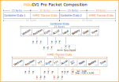

# Nolo CV1 Driver

This is the driver for the [Nolo VR](https://nolovr.com) CV1.

## Origin

This driver was migrated from [OpenHMD](https://github.com/OpenHMD/OpenHMD). All of the orientation calculation code was migrated as well because I was unable to convert to monado's orientation code. This driver can mostly be accredited to the developers that created the OpenHMD Driver.

## Firmware Version

This driver only supports the latest nolo firmware. Please download the nolo home application and update firmware on all devices (base station, tracker, and controllers).

## Implemented Functionality

* All Controller Inputs
  * Touch Pad
  * Buttons
  * Digital Trigger (because the hardware is digital not analog).
* Positional & Orientation Tracking for Tracker and Controllers.
* SteamVR Integration using the Vive Wand model.
* Double click on left controller's system button to recenter.

## TODO

* Integrate battery levels into monado code.
  * Controllers.
  * Base station.
* Integrate connection state into monado code.
* Address Drift Issue (see Drift section).

## USB Packet

The Nolo Tracker is connected to the PC via USB 2.0+. The Nolo Tracker aggregate all tracking data and sends accross USB. The Nolo Tracker sends data for 1 cycle into 2 packets; 1 packet for controller 1 and 1 packet for controller 2.

A single Nolo USB packet contains both Controller data and Tracker data. The diagram below illustrates the USB packet composition derived from previous OpenHMD analysis, usb packet inspection using tools like [monado-usb-inspector](https://gitlab.freedesktop.org/mspeth/monado-usb-inspector), and testing.

### Tick Field

Each tracked device (tracker, controller 1 and controller 2) includes a tick field. The tick field starts at 0 and goes to 255. The field will loop back to 0 after 255. I guess the tick field is simply a way to indicate the order of the packets instead of associating a packet with a clock. This monado driver records the tick but presently doesn't use the tick.

### Battery

The battery field indicates the battery level for the nolo controllers. The Tracker is powered by USB but also has a battery field that reports the base station battery level.

## Drift

This driver experiences drift. The drift is about the same as it was on the OpenHMD. As of 2024-02-25, a double click on the left controller's system button will recenter the tracker & both controllers.

This measure makes using the nolo cv1 semi-usable but is not a good experience overall. A goal is to fix drift perhaps using some of the unknown fields in the protocol or perhaps the 2-point drift field. I don't have enough knowledge at this point to programatically address drift.

Hopefully someone that understands drift and how to prevent it will take a look and see if there is any way to correct it within Mondado.
